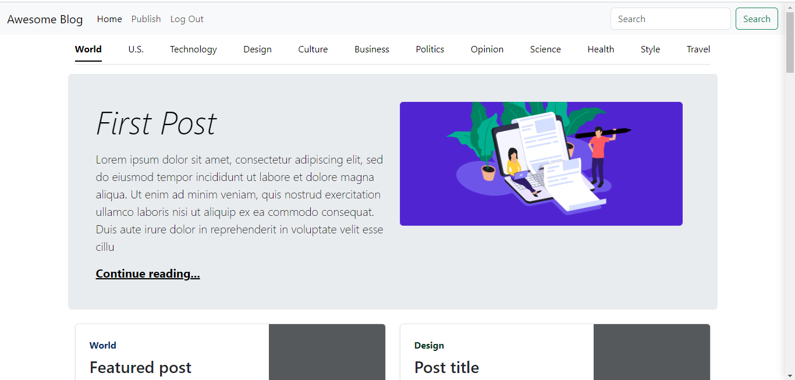

# Django Blog Application

This is a basic Django blog application that allows users to read articles and sign up to post their own articles. It provides a simple and intuitive interface for users to interact with blog posts, making it easy for anyone to contribute to the blog.

## Features
- **Read Articles:** Anyone can browse and read articles.
- **Comment on Articles:** Users can leave comments on articles.
- **User Registration:** Users can sign up for an account.
- **Create Articles:** Registered users can create and publish their own articles.
- **Authentication:** Secure user authentication for sign up and login.

## Usage

- **Homepage: Displays a list of all published articles.**


- **Article Detail: Click on an article title to read the full article.**


- **Sign Up / Login: Use the links on the homepage to sign up for a new account or log in with an existing account.**
 

- **Create Article: After logging in, you can create a new article by clicking on the "Publish" link.**

## Requirements

- Python 3.9 or higher
- Django 4.2
- SQLite 3

## Installation

1. Clone the repository:

```
git clone https://github.com/awolcat/django_blog.git
cd django_blog
```

2. Create a virtual environment:

```
virtualenv env
source env/bin/activate  # On Windows use `env\Scripts\activate`
```

3. Install dependencies:

```
pip install -r requirements.txt
```

4. Apply migrations:

```
python manage.py migrate
```

5. Create a superuser (optional):

```
python manage.py createsuperuser
```

6. Run the development server:

```
python manage.py runserver
```

7. Open your browser and visit http://127.0.0.1:8000/


Contributing
If you want to contribute to this project, please follow these steps:

Fork the repository.
Create a new branch: git checkout -b my-feature-branch
Make your changes and commit them: git commit -m 'Add some feature'
Push to the branch: git push origin my-feature-branch
Submit a pull request.
License
This project is licensed under the MIT License. See the LICENSE file for more details.

Contact
If you have any questions or feedback, feel free to reach out to me at albertirura11@gmail.com.